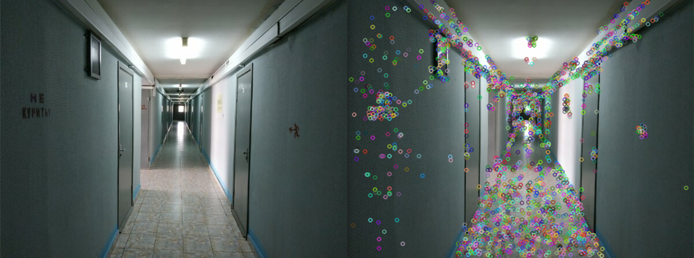

# How the `fastExtractor` function works
It detects corners using the FAST algorithm and writes info about them into vector.
In it , as mandatory arguments , you need to put:

1. A reference to the matrix (`cv::Mat&`) that stores the image.
2. A link to a vector that will store meta information about the features of this image (`std::vector<cv::KeyPoint>&`).

The other parameters already have default values, they can be omitted. But you can try to improve the operation of the extractor and for this you will already have to change the other parameters:

3. Number (`int`). This is the minimum value by which the color intensity of all neighboring pixels should be higher or lower than the candidate pixel.
4. Boolean value (`bool`). Suppression of non-key points. It works with questionable efficiency. Here is what is written in the documentation: <b>if true, non-maximum suppression is applied to detected corners
(keypoints).</b>
5. Detector type (`FastFeatureDetector::DetectorType`). This affects how many pixel neighbors (and with which specific neighbors) we are comparing our candidate pixel. About how the types differ: (https://stackoverflow.com/questions/41809634/opencv-fast-type-5-8 ). Possible values of the type:
   - FastFeatureDetector::TYPE_9_16 
   - FastFeatureDetector::TYPE_7_12
   - FastFeatureDetector::TYPE_5_8

After the completion of the function in the vector (`std::vector<cv::KeyPoint>`), the link to which we passed, will record meta information about the features in the image.

#  Examples of function results



# How to use `fastExtractor`?
 First of all, call this function on the source image and vector in which the points will be stored. After that, if you need it, you can mark key points on the image using the OpenCV `drawKeypoints` function. Your code might look something like this:
```C++
fastExtractor(image, features);
drawKeypoints(image, features, result);
```