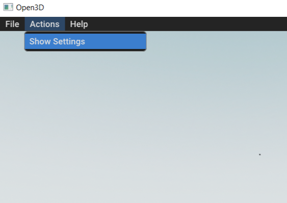
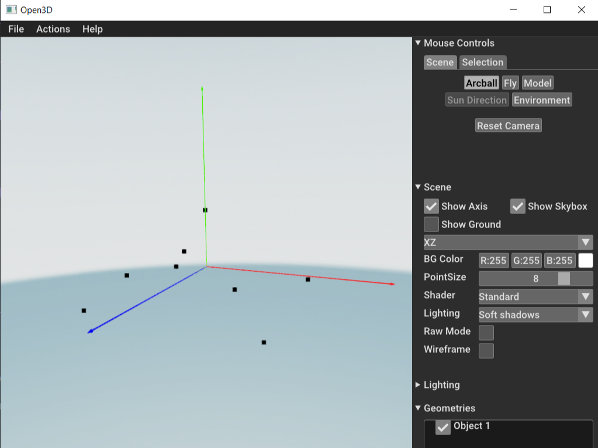

# Установка виртуального окружения
```shell
#создаём в терминале виртуальное окружения с названием .venv
...\python_utility> python3 -m venv .venv

#активация виртуального окружения на Windows
...\python_utility> .venv\Scripts\activate
#активация на Unix или MacOS
.../python_utility$ source .venv/bin/activate

#установка необходимых библиотек и зависимостей
(.venv) ...\python_utility> python3 -m pip install -r requirements.txt

#деактивация (при необходимости)
(.venv) ...\python_utility> deactivate
```

# Содержание config.py
Пример config.py:
```python
PROJECT_PATH = "~/Develop/slam-indoor-code"
VIZ_FILE_PATH = "data/points.txt"
VIZ_PARSE_FORMAT = "xyz"
```

# Шаблон содержания .txt файла с облаком точек
Формат содержания points.txt файла:
```CMake
# X Y Z
0 2 0
3 -1 3
3 -1 -3
-3 -1 3
-3 -1 -3
-2 0 -2
-2 0 1.95
1.873 0.012 2.12
```

# Как работать с GUI Open3D
#### Открываем в GUI меню с настройками 


#### Теперь можно играться с параметрами и режимами. В режиме `Fly` можно управлять камерой клавиатурой